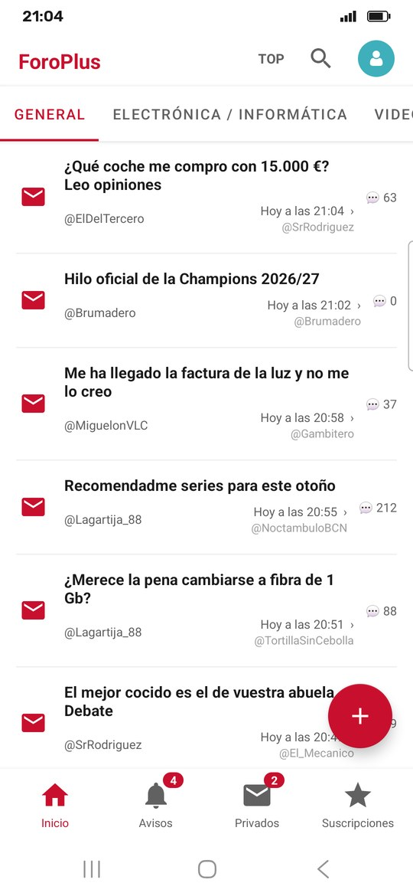
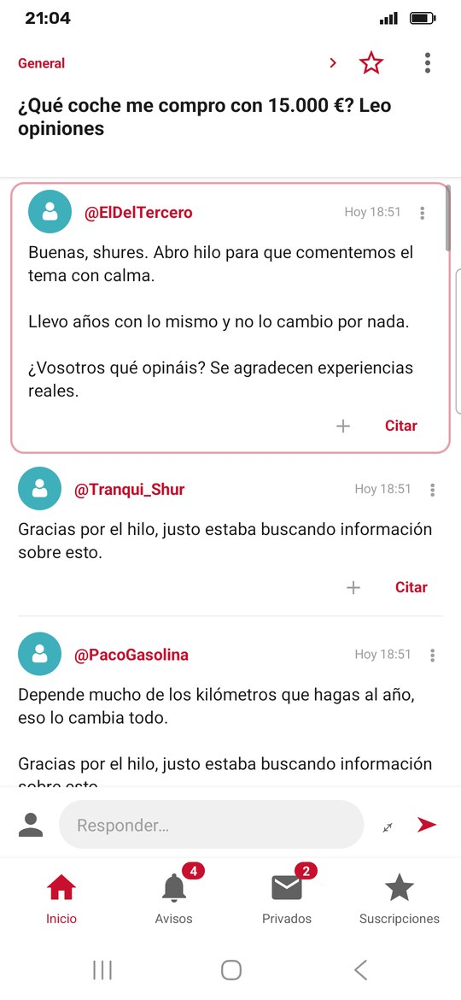
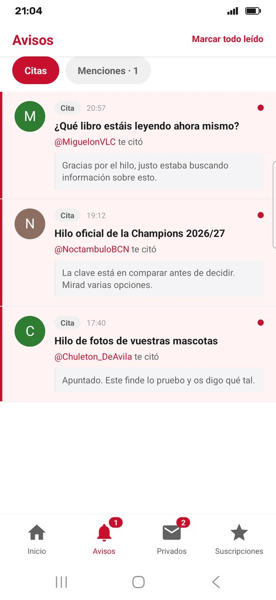
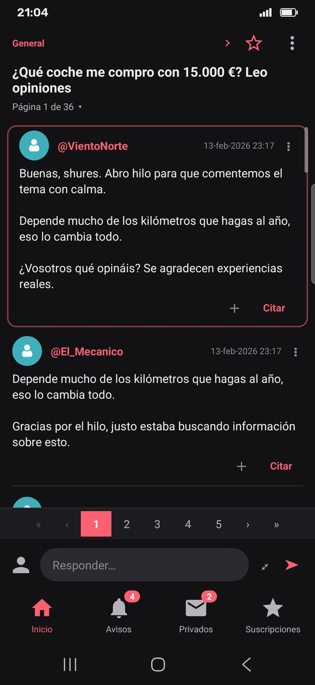

# ForoPlus

Cliente **no oficial** de ForoCoches para Android. Gratis, sin anuncios y con interfaz nativa.

**[Descargar en Google Play](https://play.google.com/store/apps/details?id=com.foroplus.app)** · [APK en GitHub](#descargar-y-verificar) · [Grupo de Telegram](https://t.me/foroplus)

<p>
  
  
  
  
</p>

> Proyecto personal, sin relación con ForoCoches. Se desarrolló en privado desde marzo de 2026;
> el código se publica a partir de la versión 1.11.0.

## Qué hace

- **Ignorados de verdad**: el usuario ignorado desaparece, sus hilos de la lista y las citas que le
  hacen. Se sincronizan con tu cuenta del foro en los dos sentidos.
- **Filtro de palabras**: los hilos con esas palabras en el título dejan de salir. También se puede
  callar un hilo concreto.
- **Último que ha escrito**: debajo de la hora de cada hilo, sin tener que entrar.
- **Avisos**: citas, menciones y privados con su número en la barra.
- **Perfiles completos**: fecha de alta, mensajes al día, firma, coche y ubicación.
- **Modo oscuro** en toda la app, también dentro de los hilos.
- Pestañas de subforos, varios subforos en una sola, hilos del momento, ver solo los mensajes del
  OP, hilos para leer sin conexión, varias cuentas, compartir un mensaje como imagen.
- Tuits, Instagram, TikTok, YouTube y Vocaroo se ven dentro del hilo, con vídeo flotante.
- Responder, citar y multicitar, crear y editar hilos, privados, suscripciones, buscador y encuestas.
- **Sección +18** (opcional, viene apagada): una pestaña con los hilos etiquetados `+18`, `+16`,
  `+14`, `+prv` y `+hd`, con su histórico, filtros por etiqueta y la opción de ocultarlos en las
  listas normales.

## Privacidad

- **La app no se conecta a ningún servidor nuestro.** Habla directamente con forocoches.com desde
  tu móvil, con tu cuenta de siempre. Nadie más ve lo que lees ni lo que escribes.
- La sesión se guarda **solo en tu móvil**.
- Lo único que la app consulta fuera del foro: las imágenes y los contenidos incrustados de los
  mensajes (en sus propias webs) y un fichero público de configuración en GitHub
  ([`RemoteConfig.kt`](app/src/main/java/com/fcplus/forocoches/RemoteConfig.kt)) que sirve para
  avisar de actualizaciones o de problemas. Ese fichero no recibe ningún dato tuyo.
- **La sección +18**, solo si la activas, descarga una lista pública de hilos de
  [`neonforger/foroplus-mas18`](https://github.com/neonforger/foroplus-mas18) en GitHub. La prepara
  un servidor de ForoPlus que lee el foro **como invitado**; la app no habla con ese servidor ni le
  manda nada, y solo acepta descargar la lista de esa dirección
  ([`FuentesPermitidas.kt`](app/src/main/java/com/fcplus/forocoches/FuentesPermitidas.kt)). Lo que
  hace el servidor no se puede comprobar desde fuera, y no hace falta: no recibe nada de nadie.
- [Política de privacidad](docs/privacy-policy.html).

## Descargar y verificar

Hay dos canales, y **no se mezclan**:

- **[Google Play](https://play.google.com/store/apps/details?id=com.foroplus.app)**: se actualiza
  sola desde la tienda.
- **[GitHub Releases](https://github.com/neonforger/foroplus/releases)** (desde la 1.11.2): el APK
  lo compila y lo firma GitHub Actions a partir del código de cada tag
  ([`release.yml`](.github/workflows/release.yml)).

Las dos usan el mismo paquete (`com.foroplus.app`) pero firmas distintas, así que Android no deja
instalar una encima de la otra: para pasar de un canal al otro hay que desinstalar la que tengas, y
se pierden la sesión y los ajustes.

La versión de Play la vuelve a firmar Google, y Play le añade su propia protección contra
manipulaciones, así que ese APK no es exactamente lo que sale de este código. **La que se puede
verificar contra el código es la de GitHub:**

1. **SHA-256 del APK**, que viene en las notas de cada release:
   ```bash
   sha256sum ForoPlus-1.11.2.apk
   ```
2. **De dónde sale**: cada APK lleva una *attestation* de GitHub que dice de qué commit y de qué
   workflow se compiló.
   ```bash
   gh attestation verify ForoPlus-1.11.2.apk -R neonforger/foroplus
   ```
3. **Certificado de firma**, el mismo en todas las versiones del canal GitHub:
   ```bash
   apksigner verify --print-certs ForoPlus-1.11.2.apk
   ```
   Tiene que salir este SHA-256:
   `a5cef9c494a13d430a4bc42dcee52e4d57502032517d1f02951eba08eb37b3a5`

## Cómo funciona

Por dentro hay un WebView invisible que carga el foro y hace de **motor**: todas las peticiones
salen de ahí, con tus cookies, como si fuera el navegador. Un script inyectado
([`extractor.js`](app/src/main/assets/extractor.js)) lee el HTML y lo pasa a JSON, y la interfaz
que ves está hecha entera en Kotlin. La web del foro no se enseña nunca.

Para escribir (responder, editar, privados…) la app trae el formulario real del foro, copia todos
sus campos y solo cambia el texto, así que no reimplementa ningún protocolo.

| Fichero | Qué hace |
|---|---|
| `app/src/main/assets/extractor.js` | Lee el HTML del foro y lo devuelve como JSON |
| `app/src/main/java/.../MainActivity.kt` | Pantallas, navegación y el puente con el motor |
| `app/src/main/java/.../ShellBridge.kt` | Las llamadas del motor a Kotlin |
| `app/src/main/java/.../PostAdapter.kt` | Cómo se pinta cada mensaje |
| `app/src/main/java/.../EmbedView.kt` | Tuits, vídeos y demás contenido incrustado |
| `tools/oracle/` | Pruebas de los lectores de HTML contra páginas guardadas |

## Compilar

Hace falta el JDK 17 y el SDK de Android.

```bash
./gradlew assembleDebug        # APK de pruebas (com.foroplus.app.v2, convive con la de Play)
./gradlew testDebugUnitTest    # tests
```

La versión de release necesita un `keystore.properties` con tu propia firma; sin él, `bundleRelease`
falla a propósito.

## Fallos e ideas

En el [grupo de Telegram](https://t.me/foroplus) o abriendo una *issue* aquí.

## Contribuir

Los pull requests son bienvenidos. Para cambios grandes, mejor abrir antes un issue o comentarlo
en el [grupo de Telegram](https://t.me/foroplus). Lo que aportes entra bajo la misma licencia.

## Licencia

[GPL-3.0](LICENSE): puedes usar, estudiar, modificar y redistribuir el código, siempre que lo que
distribuyas siga siendo GPL-3.0 con su código fuente.

**Lo que NO cubre la licencia:**

- **El nombre ForoPlus**: no se concede ningún derecho de marca sobre él (apartado 7(e) de la
  GPL-3.0).
- **El icono de la app**: las imágenes `ic_launcher*.png` de `app/src/main/res/mipmap-*/`. Están
  en el repo para que el proyecto compile, pero no se licencian bajo la GPL-3.0: todos los
  derechos reservados.

Si publicas una versión modificada, ponle otro nombre y otro icono, para que nadie la confunda con
esta.
